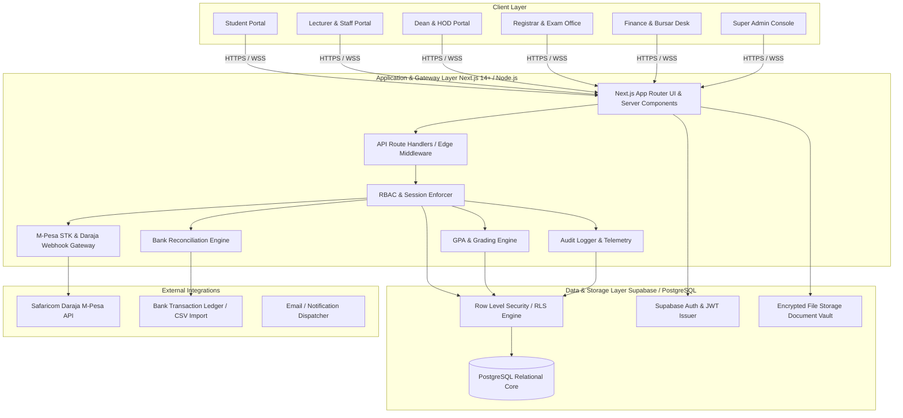

# 🏛️ UAMS Architecture & Technical Design

## 1. System Topology & 3-Tier Architecture

The **University Administration Management System (UAMS)** is engineered as a secure, distributed, modular platform leveraging Next.js, Node.js runtime, Supabase (PostgreSQL), and server-side payment gateways.

---

## 2. Role-Based Access Control (RBAC) Matrix

| Module / Resource | Super Admin | Univ Admin | Registrar | HOD | Lecturer | Finance Officer | Student |
|---|:---:|:---:|:---:|:---:|:---:|:---:|:---:|
| **User & Role Provisioning** | Full (CRUD) | Read/Assign | No Access | No Access | No Access | No Access | No Access |
| **Schools & Departments** | Full | Full | Read-Only | Read-Only | Read-Only | Read-Only | Read-Only |
| **Programs & Curricula** | Full | Full | Manage | Manage | Read-Only | Read-Only | Read-Only |
| **Student Profiles & Enrollment** | Full | Full | Full | Department View | Enrolled View | Financial View | Self-Profile |
| **Staff & Lecturer Directory** | Full | Full | View | Department View | Self-Profile | View | View |
| **Course Catalog & Prerequisites** | Full | Full | Manage | Manage | Read-Only | Read-Only | Read-Only |
| **Course Registration & Approval** | Full | Full | Full (Approve) | Review | View Roster | Financial Check | Register / Drop |
| **Attendance Sessions & Records** | Full | View | View | Review Dept | Mark / Edit | No Access | View Self |
| **Coursework & Exam Marks** | Full | View | Review / Seal | Moderate Dept | Enter / Submit | No Access | View Approved |
| **GPA & Result Transcripts** | Full | View | Generate / Issue | View Dept | View Assigned | No Access | View Self Slip |
| **Fee Structures & Invoices** | Full | View | View | No Access | No Access | Full (CRUD) | View Self Balance |
| **M-Pesa / Bank Transactions** | Full | View | View | No Access | No Access | Verify / Reconcile | Initiate M-Pesa |
| **Timetables & Scheduling** | Full | Manage | Manage | Manage Dept | View Teaching | View | View Personal |
| **Announcements** | Global | Campus-Wide | Academic | Departmental | Course-Level | Fee Reminders | Read-Only |
| **Audit Logs & Security Trail** | Full | No Access | No Access | No Access | No Access | No Access | No Access |

---

## 3. Security Hardening & Zero-Trust Principles

1. **Server-Side Authorization:** Every endpoint verifies token claims, role assignments, and ownership constraints at the API level rather than relying on UI state.
2. **PostgreSQL Row Level Security (RLS):** Policies prevent cross-tenant and horizontal privilege escalation (e.g. students can only query their own registration, invoice, and grade records).
3. **Isolated Payment Secrets:** M-Pesa Consumer Keys, Passkeys, and Bank API secrets are stored strictly on the server/edge environment and never exposed in browser bundles.
4. **Immutable Audit Trail:** Critical operations (grade overrides, fee waivers, status changes, permission modifications) write tamper-evident records to `audit_logs`.
