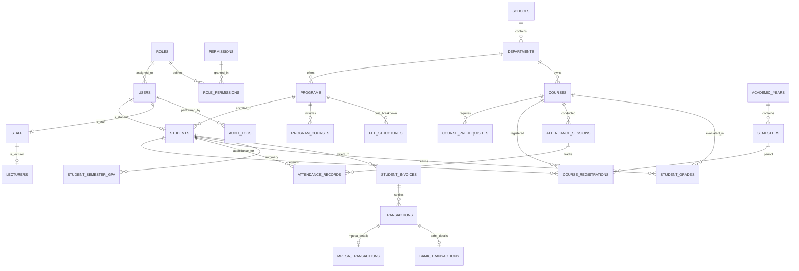

# 🗄️ UAMS Database Design & Entity Dictionary

## Entity Relational Overview

## Tables & Roles Summary

1. **`users` & `roles`**: Central authentication, user profiles, and RBAC enforcement.
2. **`schools`, `departments`, `programs`**: Academic hierarchy from faculty down to degrees.
3. **`courses` & `course_prerequisites`**: Curricula, credit hours, prerequisites, and program course matrices.
4. **`students` & `guardians`**: Student admissions, biodata, contact points, and emergency relations.
5. **`staff`, `lecturers`, `course_allocations`**: Faculty management and semester teaching assignments.
6. **`course_registrations`**: Semester enrollment with approval states (`pending`, `approved`, `dropped`).
7. **`attendance_sessions` & `attendance_records`**: Daily/weekly attendance rolls with automatic percentage metrics.
8. **`student_grades`, `grading_scales`, `student_semester_gpa`**: CATs, final exams, 4.0 grading system, CGPA engine.
9. **`fee_structures`, `student_invoices`, `transactions`**: Comprehensive student ledger with M-Pesa & Bank reconciliation.
10. **`timetables`, `announcements`, `audit_logs`**: Lecture scheduling, broadcast notifications, and security audit log.
